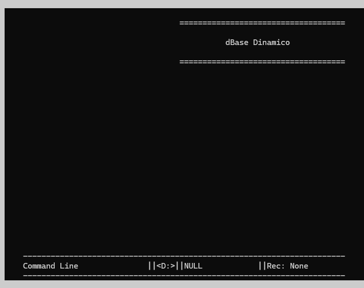
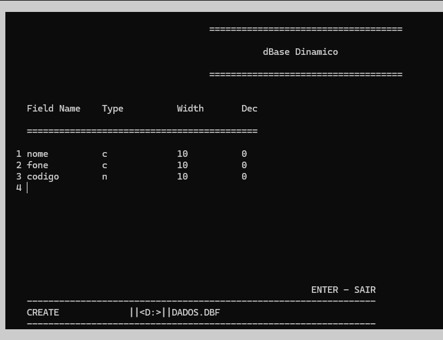
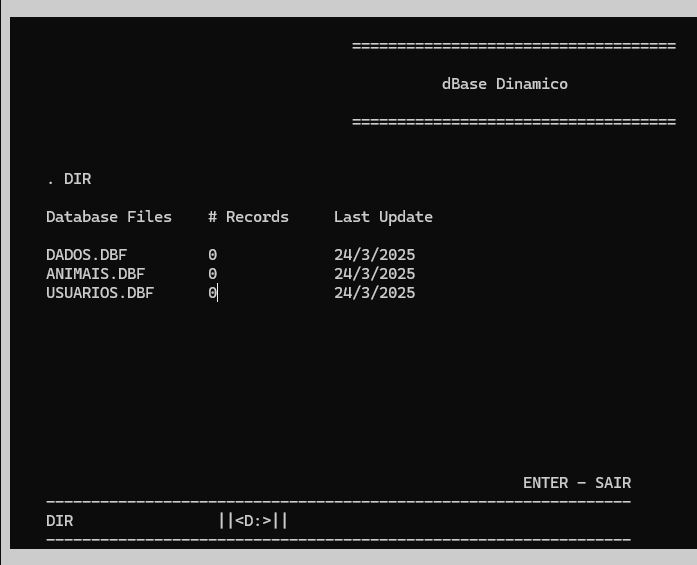
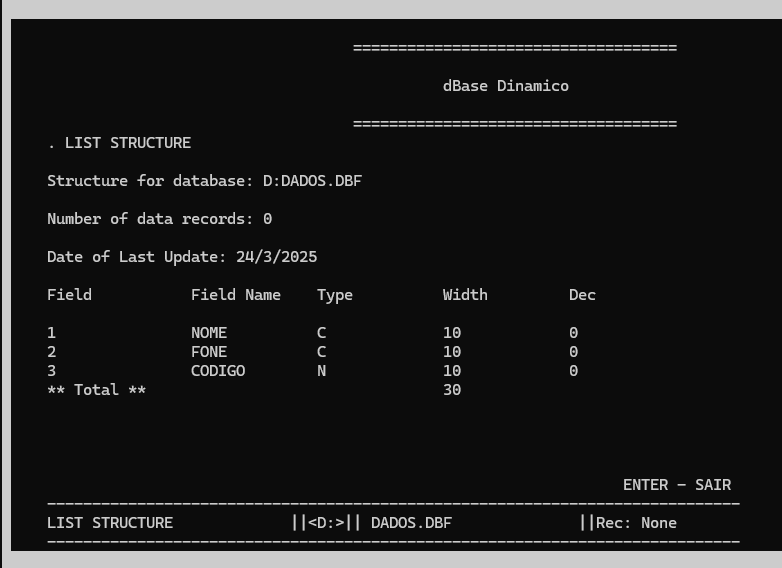
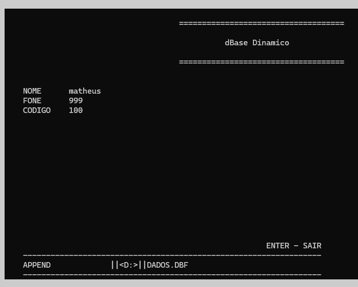
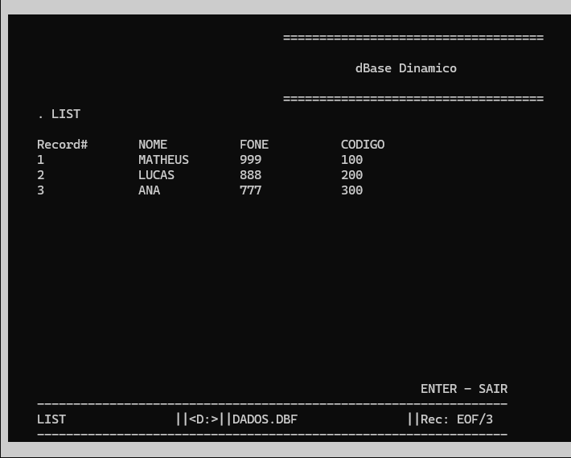
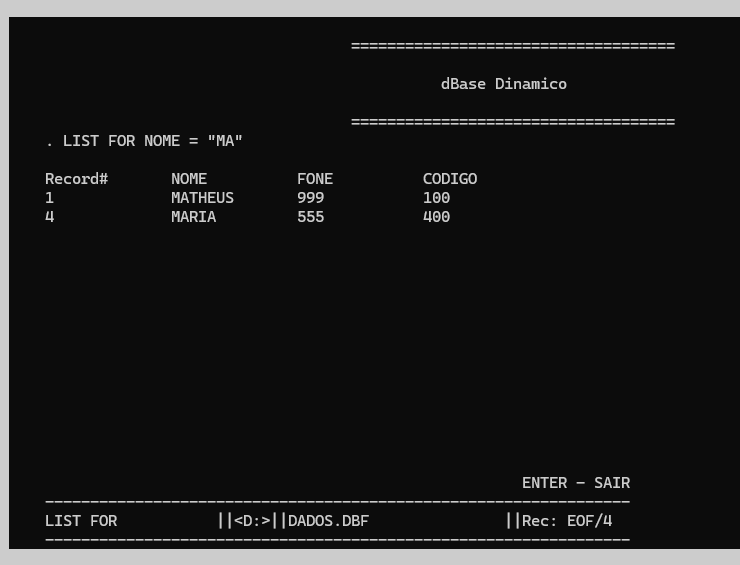
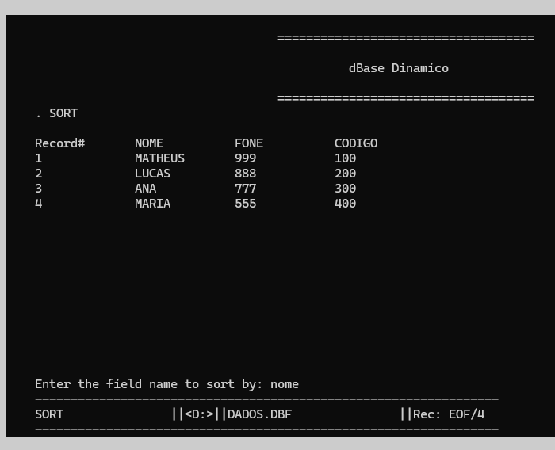
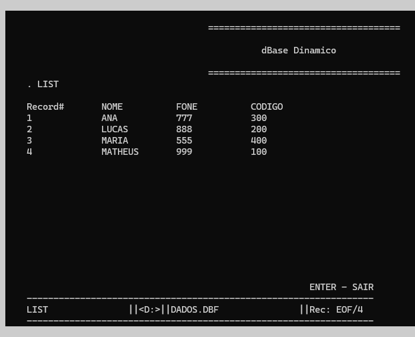

# dBaseDinamico
<h3>dBase com listas encadeadas dinâmicas em C. A partir da linha de comando digitada pelo usuário, é interpretado e validado sua sintaxe e seus respectivos parâmetros. Sua interface se assemelha ao dBase original (década de 80, 90) e conta com suas principais funcionalidades: </h3>
1) SET DEFAULT TO:
2) CREATE : Cria um novo arquivo .DBF
3) DIR: para mostrar todos os arquivos .DBF criados na unidade atual.
4) QUIT: Encerra o ambiente do dBase.
5) USE: Abre um arquivo .DBF.
6) LIST STRUCTURE: Lista a estrutura criada para o arquivo .DBF.
7) APPEND: Insere novo registro ao final.
8) LIST: Lista todos os campos.
9) CLEAR: Limpa a tela do ambiente do dBase. (Não implememtado)
10) LOCATE: Localiza registro(s), informando o campo e o conteúdo a ser buscado.
11) GOTO: Vai para determinado registro.
12) DISPLAY: Mostra o registro atual.
13) EDIT: Permite alterar os dados do registro atual.
14) DELETE: Marca o registro atual para exclusão (um tipo de exclusão lógica).
    DELETE ALL {este comando marca todos os registros para exclusão} 
15) RECALL: Reativa o(s) registro(s) marcado(s) para exclusão.
    RECALL ALL
16) SET DELETED
    SET DELETED OFF {Este comando permite que se possa visualizar e ou reativar registros marcados para exclusão}
    SET DELETED ON {Este comando esconde os registros marcados para exclusão}
17) PACK: Exclui fisicamente os registros marcados para exclusão.
18) ZAP: Este comando exclui todos os registros do arquivo .DBF em uso.
19) MODIFY STRUCTURE: Permite modificar a estrutura do arquivo .DBF (alterar os campos existentes ou criar novos).
20) SORT: Ordena os dados em relação a algum campo especificado.

<h4>Exemplos de algumas funcionalidades:</h4>

Menu Principal

Create

Dir

List Structure

Append

List

List For

Sort

